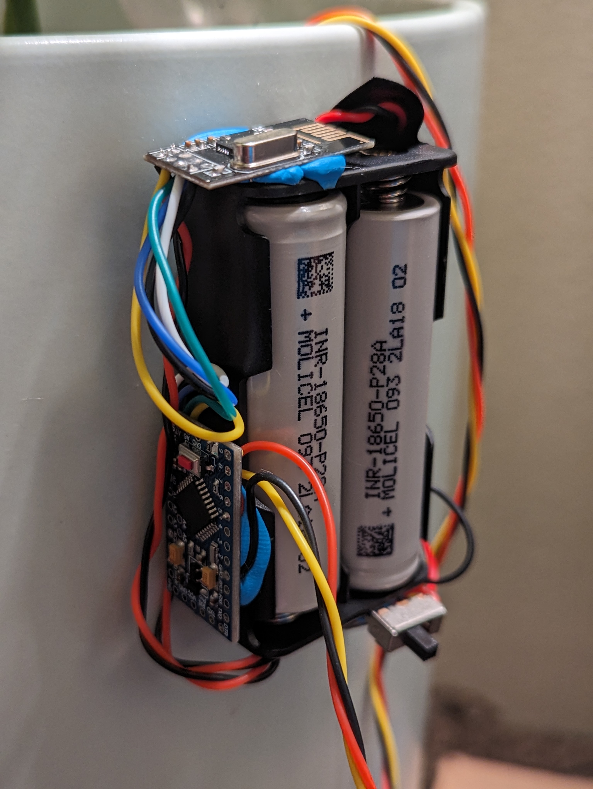

<section>
	<h4>Plant Monitor</h4>
	
	<h5>What is this?</h5>
	

The plant monitor is a culmination of curiosity and being too stubborn to give up. I wrote all the code for both the microprocessor and the site backend. It went through a few iterations of design, but the current design is pretty stable. The setup is an ESP32 base station coded to receive the data from the plants via an nRF24 radio. The plants have Arduino pro mini 3.3 boards and are connected to a capacitive moisture sensor. I'm already working on how to fully automate the system so that the plants water themselves, but I'm not quite there yet.

	
</section>

--------------------------------------------------------------------------------
